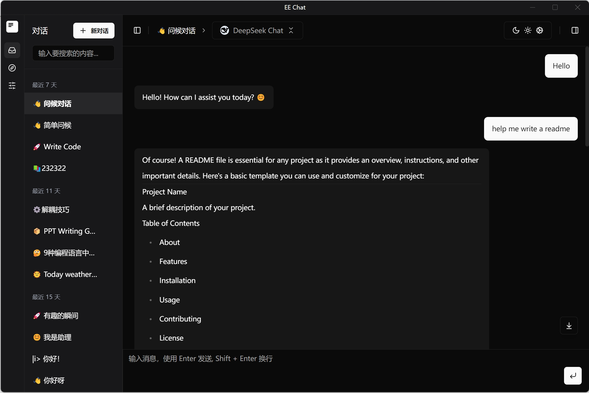

<div align="center">
  <h1>EE Chat</h1>
  <p>🚀 强大的本地部署AI聊天应用</p>

  <p>
    <a href="#特性">特性</a> •
    <a href="#本地部署">本地部署</a> •
    <a href="#快速开始">快速开始</a> •
    <a href="#技术栈">技术栈</a> •
    <a href="#贡献">贡献</a> •
    <a href="#许可证">许可证</a>
  </p>
  
  
</div>

## 特性

eechat是一款专注于本地部署的AI聊天应用，为用户提供安全、私密且高效的AI对话体验。

### 🔒 完全本地化部署

- **数据隐私保障**：所有对话数据存储在本地，无需担心隐私泄露
- **离线使用**：配置完成后，无需持续联网即可使用
- **自定义API**：支持连接到您自己的AI模型API或第三方服务

### 💬 强大的对话功能

- **多会话管理**：轻松创建和管理多个独立对话
- **历史记录**：自动保存所有对话历史，随时查看和继续之前的对话
- **Markdown支持**：完美渲染Markdown格式，包括代码块、表格和数学公式
- **代码高亮**：自动识别并高亮显示代码块，支持多种编程语言

### 🎨 个性化体验

- **主题切换**：内置明暗两种主题，满足不同使用场景需求
- **自定义提示词**：可保存和管理常用提示词，提高对话效率
- **模型参数调整**：灵活调整温度、最大输出等参数，获得最佳回复效果

### 🔌 扩展性

- **插件系统**：支持扩展功能，满足特定场景需求
- **API集成**：轻松集成各种AI模型API，如OpenAI、Anthropic等
- **自定义模型**：支持配置和使用自定义的本地或远程AI模型

## 本地部署

eechat专为本地部署设计，确保您的数据安全和使用体验。

### 系统要求

- Windows 10/11 64位
- macOS 10.15+
- Linux (Ubuntu 18.04+, Debian 10+)
- 至少4GB RAM
- 500MB可用磁盘空间

### 安装方式

#### 下载预构建包

从[发布页面](https://github.com/Lucassssss/eechat/releases)下载适合您系统的安装包：

- Windows: `eechat-Setup-x.x.x.exe`
- macOS: `eechat-x.x.x.dmg`
- Linux: `eechat-x.x.x.AppImage` 或 `.deb`

#### 从源码构建

```bash
# 克隆仓库
git clone https://github.com/Lucassssss/eechat.git
cd eechat

# 安装依赖
npm install

# 开发模式运行
npm run dev

# 构建应用
npm run build